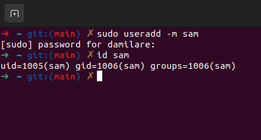
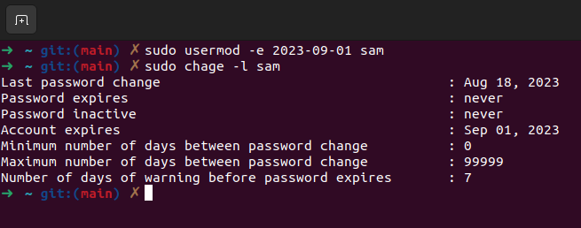
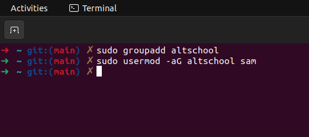
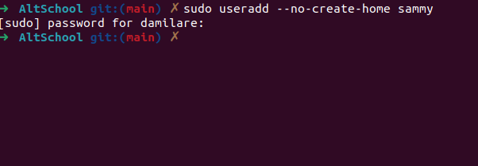

step 1 : Create a user using the useradd command

step 2 : Set an expiry date for usermod -e 

step 3 : prompt user to change password upon login using chage --lastday 0 command

step 4 : attach a user to teh group altschool using usermod -aG altschool

step 5 : create a user without home directory using useradd --no-create-home

step 6 : allow altschool group to be able to run only cat command on /etc/
